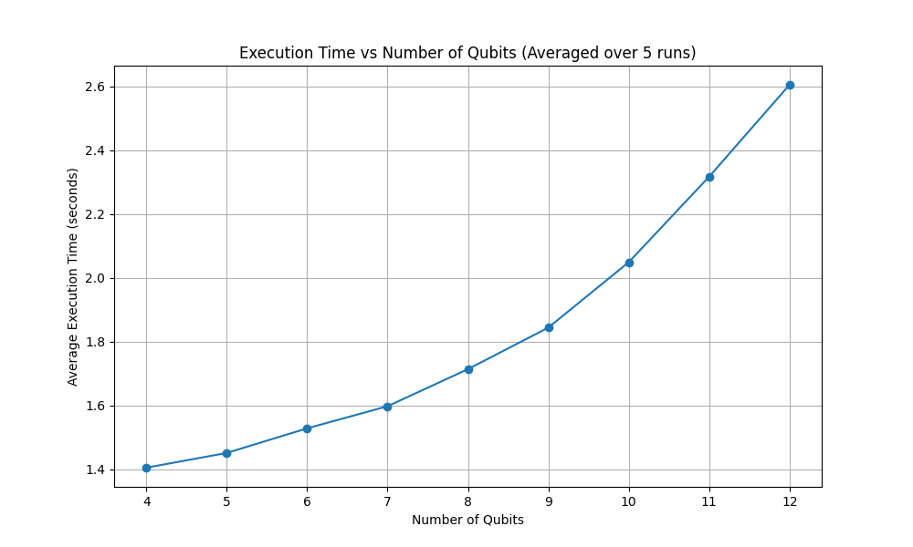
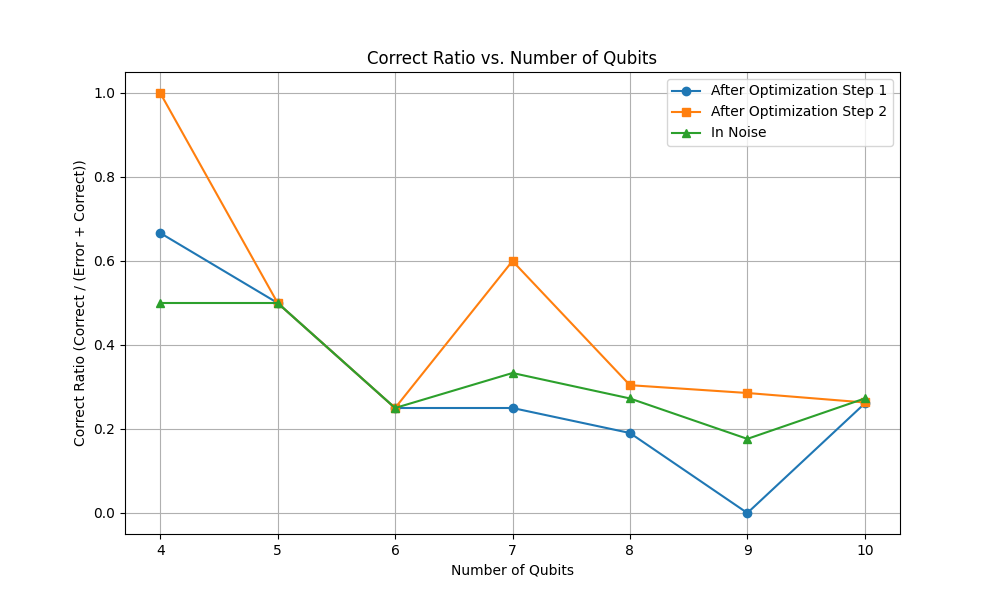
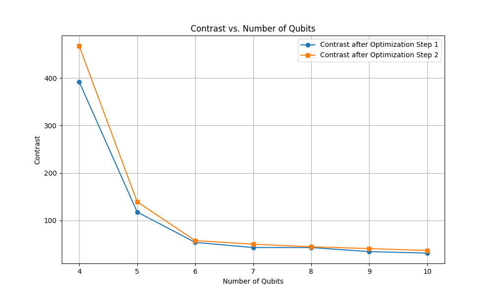

## Bullet points:
1. Two .ipynb files, R_x.ipynb and R_y.ipynb, are the main submittion of this 
2. You can just press run for both .ipynb file and get result below box "RESULT BELOW", which is located near the end of the document
3. These two programes find optimized parameter for arbitrary clause using a two-step method: a rough search that is accurate to 10e-2 level, followed by gradian decent that improves the accuracy to 10-3 level. The effectiveness of this two-step method is explained in the section "effectiveness of optimization" below.
4. The end of these .ipynb files contain codes that submit the circuit to IBM plateform, they are disabled as comments.

## How I made the number of qubits easy to change
the construction of the quantum circuit can be broken down into three parts, the hadamard part, the seperator part and the mixer part. The parameterization of the hadamard part is trivial, the parameterization of the mixer of my choise($R_x$ and $R_y$)is also trivial. The construction of the seperator can be achieved by defining in advance a 2-controled phase gate(ccp gate), then apply ccp gate and x gate according to the clauses.

In sum, the qubit number of the circuit is easily changed in the circuit construction procedure I used.

## How is the circuit tested
After runing the circuit with given num_qubit and clause, the result is analyzed as follows:
1. a cutoff count is given according to the result distribution, states that has counts beyound cutoff count is considered an answer and are chosen for later analysis(the selection of cutoff count reminds me of the cutoff power of radar signal processing, which I have extensive experience in, however I don't have the time to implement that, hopfully I can do that after the final exam, for now all the cutoff counts are just hand picked)
2. the correct answer is calculated classically to determine the correctness of the result of the quantum circuit.
3. (number of correct state/number of all state chosen) is the correct rate of the circuit
4. (sum of the count of all the state that should be correct)/(the rest of the counts), called contrast in the following sections, is my analogy to SNR in this case, which is also investigated in the scaleability section.

## Generization:
The optimization method I use are able to optimize parameter $\gamma, \beta$ in arbitrary given clause, but the performence in different clause differs significantly. For instance, result for clause[(0, False, 1, False), (1, False, 2, False)] is better than that of clause[(0, False, 1, False), (1, False, 2, True)]. This is true for both mixers.

## Scaleability 
No extreme qubit number was tested due to time constrain, but the program can conduct simulation job with 10 qubits with ease. Notice that the majority of the processing time is contribute by optimization. The plot of execution time to circuit simulation is given below

The correctness of the circuit using $R_x$ mixer after step 1 of optimization, after step 2 of optimization and in noise are ploted below. They shared the same Clause. 

The contrast of counts that are supposed to be the answer(given by classical solver) and the rest is given below:

## Quantum Computer run:

The output of qantum computer run using parameter: num_qubit=4, clause = [(0, False, 1, False), (1, False, 2, False)], here False indecate no NOT on this element of clause.

Result wise the outcome is similar to that of a noisy simulation, but the count of non-answer output is bigger.

## different Mixer:

Using $U_y$mixer, I got 100 percent in one correct answer in noiseless result, and the result is better in noisy environment, but it faild to give all the results possible in num_qubit=4 runs. Using $R_x$, the results has less counts but both result for num_qubit=4 runs are all given and reproduceable. Two .ipynb submitted compared difference in performence using different mixers under the same qubit number and clause.

## statistics of results:
no extensive statistics were taken due to limited time I have on my hand, but a simple mean and variance were taken in the R_x.ipynb file under box"simple statistics"