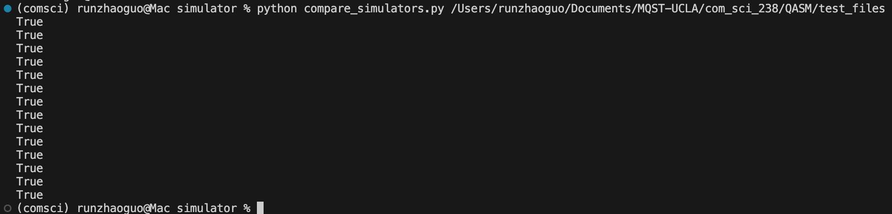
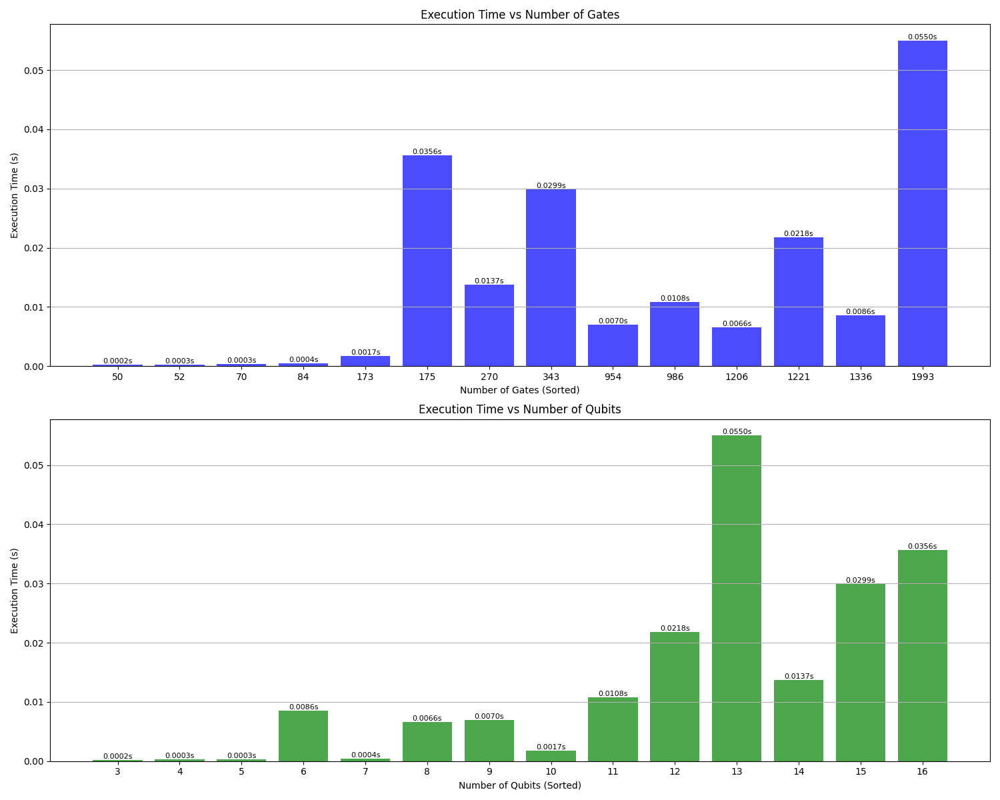

## How I parameterize the solution in the number of qubits
*determine how many qubit to use:* record the qubit used in .qasm file, determine how many to use by looking at the biggest qubit recoreded.

*how to simulate circuit with arbitrary number of qubit:* I discirbe the circuit to simulate using a class QuantumCircuit, it has a parameter num_qubits, we can parameterize qubit number by using that parameter

## How I tested my simulator and my result
I test the simulator using the compare_simulators.py file given. the results are all "True".

A copy of the file I used is up loaded as well, you can run it in terminal.

*scalability* a figure mapping num_qubit and num_gate to execution time is also uploaded. The scalability for my current version of simulator is good, we can finish simulating all 14 test cases in under 1s. 

I mention current because I used to simulate using density matrices, with takes much longer. But I'm still proud to share that using parallel computing librarys and sparse matrices, the execution time for a single test case can be reduced down to less then 10 minutes, which is much quick then QuTip can do the same simulation for the same circuit. You can check it out in my github: Harrbit/MQST-UCLA/blob/rz_personal_1/com_sci_238/QASM/qasm_main_matrix.py

## How to run the program:

I uploaded a compare_simulations.py. Run in terminal as such: 

python compare_simulations.py path/to/folder_that_contains_test_file/

what it looks on my terminal:
